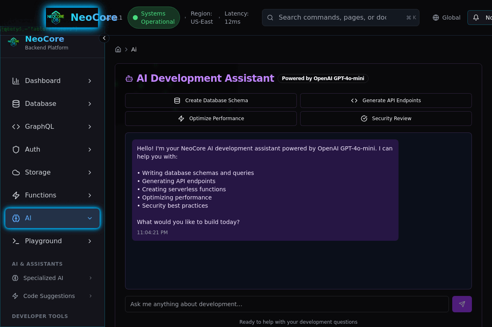

# NeoCore Platform

<div align="center">
  
  
  > A modern, AI-powered backend development platform built with React, Express.js, and PostgreSQL
</div>

<div align="center">

[](https://replit.com/new/github/your-username/neocore-platform)
[](https://www.typescriptlang.org/)
[](https://reactjs.org/)
[](https://expressjs.com/)
[](https://postgresql.org/)
[](https://openai.com/)

</div>

<div align="center">

## 🎬 Live Demo @ https://neocore.one

[](https://95696bee-84d9-4837-9bc2-9eeddf5ac3b7-00-1hdffzptk9i7.worf.replit.dev)

**[→ Try the Live Demo]((https://neocore.one))**



*Slow-paced demo showing all main features - each page displays for 3 seconds so you can see the details: Dashboard, Database Management, GraphQL Playground, Authentication, Storage, Functions, AI Assistant, and API Testing*

</div>


## 🌟 Features

### 🎯 Core Platform Features
- **Database Management**: PostgreSQL with visual query builder and real-time monitoring
- **GraphQL API**: Interactive GraphQL playground with schema explorer
- **Authentication**: Multi-provider auth system (Email, Google, GitHub, etc.)
- **Cloud Storage**: File management with bucket-based organization
- **Serverless Functions**: Deploy and manage cloud functions with real-time metrics
- **AI Assistant**: Built-in development assistant for code generation and queries
- **API Playground**: Full-featured HTTP client for testing APIs

### 🎨 Modern Cyberpunk Interface
- **Matrix Rain Effects**: Animated falling code background
- **Particle Systems**: Dynamic particle backgrounds with neon colors
- **Data Stream Animations**: Real-time data flow effects in header
- **Holographic Charts**: Custom charts with neon glow effects
- **Glass Morphism**: Advanced backdrop blur and transparency effects
- **Sound System**: Optional cyberpunk audio feedback (toggleable)

### 🔧 Developer Experience
- **Real-time Updates**: WebSocket-powered live metrics and status updates
- **Code Editor**: Syntax-highlighted code blocks with copy/run functionality
- **Interactive Dashboard**: Metrics carousel and service grid
- **Responsive Design**: Mobile-optimized cyberpunk interface
- **Type Safety**: Full TypeScript integration throughout

## ⚡ Key Features Showcase

| Feature | Description | Demo |
|---------|-------------|------|
| 🏠 **Dashboard** | Real-time metrics, system status, and service overview | [View →](./screenshots/dashboard.png) |
| 🗄️ **Database Management** | PostgreSQL interface with connection management | [View →](./screenshots/database.png) |
| 🔍 **GraphQL Playground** | Interactive API explorer and query builder | [View →](./screenshots/graphql.png) |
| 🔐 **Authentication** | Multi-provider auth system configuration | [View →](./screenshots/auth.png) |
| ☁️ **Cloud Storage** | File management and bucket organization | [View →](./screenshots/storage.png) |
| ⚡ **Serverless Functions** | Deploy and manage cloud functions | [View →](./screenshots/functions.png) |
| 🤖 **AI Assistant** | AI-powered development help and code generation | [View →](./screenshots/ai.png) |
| 🧪 **API Playground** | Complete HTTP client for testing APIs | [View →](./screenshots/playground.png) |

## 🚀 Quick Start

### Prerequisites
- Node.js 18+ 
- PostgreSQL database (we recommend [Neon](https://neon.tech/))


## 📁 Project Structure

```
├── client/                 # Frontend React application
│   ├── src/
│   │   ├── components/    # Reusable UI components
│   │   │   ├── ui/        # Base UI components (shadcn/ui)
│   │   │   ├── layout/    # Layout components
│   │   │   ├── dashboard/ # Dashboard-specific components
│   │   │   └── effects/   # Visual effects (matrix, particles)
│   │   ├── pages/         # Application pages
│   │   ├── hooks/         # Custom React hooks
│   │   └── lib/           # Utilities and configurations
│   └── index.html
├── server/                 # Backend Express.js application
│   ├── index.ts           # Server entry point
│   ├── routes.ts          # API routes
│   ├── db.ts              # Database connection
│   ├── storage.ts         # Data access layer
│   └── vite.ts            # Vite development integration
├── shared/                 # Shared types and schemas
│   └── schema.ts          # Database schema and types
└── package.json
```

## 🛠️ Technology Stack

### Frontend
- **React 18** - Modern UI library with hooks
- **TypeScript** - Type-safe JavaScript
- **Vite** - Fast build tool and development server
- **Tailwind CSS** - Utility-first CSS framework
- **Radix UI** - Accessible component primitives
- **TanStack Query** - Server state management
- **Wouter** - Minimalist client-side routing
- **Framer Motion** - Animation library

### Backend
- **Express.js** - Fast web framework for Node.js
- **TypeScript** - Type-safe server-side development
- **Drizzle ORM** - Type-safe database operations
- **PostgreSQL** - Robust relational database
- **WebSocket** - Real-time bidirectional communication

### Development Tools
- **ESBuild** - Fast bundling for production
- **Drizzle Kit** - Database migrations and introspection
- **TSX** - TypeScript execution for development

## 🔧 Development

### Available Scripts

```bash
# Development
npm run dev          # Start development server
npm run check        # Type checking

# Database
npm run db:push      # Push schema changes to database

# Production
npm run build        # Build for production
npm run start        # Start production server
```

### Environment Variables

| Variable | Description | Required |
|----------|-------------|----------|
| `DATABASE_URL` | PostgreSQL connection string | Yes |
| `PORT` | Server port (defaults to 5000) | No |
| `NODE_ENV` | Environment (development/production) | No |

## 🎨 Customization

### Theme Configuration
The application uses a cyberpunk color scheme defined in `client/src/index.css`. Key color variables:

```css
:root {
  --neon-blue: #00d4ff;
  --neon-green: #00ff88;
  --neon-pink: #ff0080;
  --cyber-dark: #0a0a0f;
  --glass-bg: rgba(10, 10, 15, 0.8);
}
```
## 🔒 Security Features

- **Input Validation**: Zod schema validation on all API endpoints
- **SQL Injection Protection**: Parameterized queries via Drizzle ORM
- **Type Safety**: Full TypeScript coverage prevents runtime errors
- **Error Handling**: Comprehensive error boundary and logging
- **CORS Configuration**: Proper cross-origin request handling

## 📊 Database Schema

The application uses a PostgreSQL database with the following main tables:

- **projects** - Main project entities
- **databases** - Database instances per project
- **api_endpoints** - API configurations
- **auth_providers** - Authentication provider settings
- **storage_buckets** - File storage containers
- **functions** - Serverless function definitions
- **ai_assistants** - AI assistant configurations
- **metrics** - Performance and usage metrics


## 🤝 Contributing

1. Fork the repository
2. Create a feature branch: `git checkout -b feature/amazing-feature`
3. Commit changes: `git commit -m 'Add amazing feature'`
4. Push to the branch: `git push origin feature/amazing-feature`
5. Open a Pull Request

## 📝 License

This project is licensed under the MIT License - see the [LICENSE](LICENSE) file for details.

## 🙏 Acknowledgments

- Design inspired by cyberpunk aesthetics and modern web design
- Built with modern web technologies and best practices
- Special thanks to the open-source community for the amazing tools

## 🗺️ Roadmap

See our [ROADMAP.md](ROADMAP.md) for planned features and improvements including:
- Real database integration with visual schema designer
- Enhanced AI assistant with code generation
- Real-time collaboration features
- Advanced monitoring and analytics
- Mobile app development

## 📞 Support

If you have any questions or issues:
https://neocore.one demo and contact

1. Check the [Issues](https://github.com/your-username/neocore-platform/issues) page
2. Create a new issue with a detailed description
3. Join our [Discord community](https://discord.gg/your-invite) for real-time help

---

<div align="center">

**Built with ❤️ by the NeoCore team**

[🚀 Live Demo](https://95696bee-84d9-4837-9bc2-9eeddf5ac3b7-00-1hdffzptk9i7.worf.replit.dev) • [📚 Documentation](https://github.com/your-username/neocore-platform/wiki) • [💬 Discussions](https://github.com/your-username/neocore-platform/discussions)

</div>